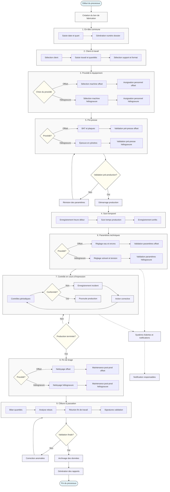

```mermaid
flowchart TD
    %% Définition des styles
    classDef processNode fill:#f9f9f9,stroke:#333,stroke-width:1px;
    classDef decisionNode fill:#fffdf0,stroke:#333,stroke-width:1px,shape:diamond;
    classDef startEndNode fill:#e6f7ff,stroke:#333,stroke-width:1px,shape:stadium;
    classDef subprocessNode fill:#f0f0ff,stroke:#333,stroke-width:1px;
    
    %% Nœuds de début et fin
    Start([Début du processus]) --> Creation
    End([Fin du processus])
    
    %% Création du bon de fabrication
    Creation[Création du bon de fabrication] --> EnTete
    
    %% Section 1: En-tête commune
    subgraph EnTete [1. En-tête commune]
        E1[Saisie date et quart] --> E2[Génération numéro dossier]
    end
    
    EnTete --> Client
    
    %% Section 2: Client & travail
    subgraph Client [2. Client & travail]
        C1[Sélection client] --> C2[Saisie travail et quantités]
        C2 --> C3[Sélection support et format]
    end
    
    Client --> Procede
    
    %% Section 3: Procédé & équipement
    subgraph Procede [3. Procédé & équipement]
        P1{Choix du procédé} -->|Offset| P2[Sélection machine offset]
        P1 -->|Héliogravure| P3[Sélection machine héliogravure]
        P2 --> P4[Assignation personnel offset]
        P3 --> P5[Assignation personnel héliogravure]
    end
    
    Procede --> PrePresse
    
    %% Section 5: Pré-presse
    subgraph PrePresse [5. Pré-presse]
        PP1{Procédé?} -->|Offset| PP2[BAT et plaques]
        PP1 -->|Héliogravure| PP3[Épreuve et cylindres]
        PP2 --> PP4[Validation pré-presse offset]
        PP3 --> PP5[Validation pré-presse héliogravure]
    end
    
    PrePresse --> ValidationPreProd
    
    %% Validation pré-production
    ValidationPreProd{Validation pré-production?} -->|Non| RevisionPreProd[Révision des paramètres]
    RevisionPreProd --> PrePresse
    ValidationPreProd -->|Oui| DemarrageProd
    
    %% Démarrage production
    DemarrageProd[Démarrage production] --> SuiviTemporel
    
    %% Section 4: Suivi temporel
    subgraph SuiviTemporel [4. Suivi temporel]
        ST1[Enregistrement heure début] --> ST2[Suivi temps production]
        ST2 --> ST3[Enregistrement arrêts]
    end
    
    SuiviTemporel --> ParamTech
    
    %% Section 6: Paramètres techniques
    subgraph ParamTech [6. Paramètres techniques]
        PT1{Procédé?} -->|Offset| PT2[Réglage eau et encres]
        PT1 -->|Héliogravure| PT3[Réglage solvant et tension]
        PT2 --> PT4[Validation paramètres offset]
        PT3 --> PT5[Validation paramètres héliogravure]
    end
    
    ParamTech --> ControleProd
    
    %% Section 7: Contrôle en cours d'impression
    subgraph ControleProd [7. Contrôle en cours d'impression]
        CP1[Contrôles périodiques] --> CP2{Conformité?}
        CP2 -->|Non| CP3[Enregistrement incident]
        CP3 --> CP4[Action corrective]
        CP4 --> CP1
        CP2 -->|Oui| CP5[Poursuite production]
    end
    
    ControleProd --> FinProduction
    
    %% Décision fin de production
    FinProduction{Production terminée?} -->|Non| ControleProd
    FinProduction -->|Oui| FinTirage
    
    %% Section 8: Fin de tirage
    subgraph FinTirage [8. Fin de tirage]
        FT1{Procédé?} -->|Offset| FT2[Nettoyage offset]
        FT1 -->|Héliogravure| FT3[Nettoyage héliogravure]
        FT2 --> FT4[Maintenance post-prod offset]
        FT3 --> FT5[Maintenance post-prod héliogravure]
    end
    
    FinTirage --> Cloture
    
    %% Section 9: Clôture & passation
    subgraph Cloture [9. Clôture & passation]
        CL1[Bilan quantités] --> CL2[Analyse rebuts]
        CL2 --> CL3[Réunion fin de travail]
        CL3 --> CL4[Signatures validation]
    end
    
    Cloture --> ValidationFinale
    
    %% Validation finale
    ValidationFinale{Validation finale?} -->|Non| RevisionFinale[Correction anomalies]
    RevisionFinale --> Cloture
    ValidationFinale -->|Oui| ArchivageDonnees
    
    %% Archivage et fin
    ArchivageDonnees[Archivage des données] --> GenerationRapports[Génération des rapports]
    GenerationRapports --> End
    
    %% Système d'alertes (transversal)
    ParamTech -.-> Alertes[Système d'alertes et notifications]
    ControleProd -.-> Alertes
    Alertes -.-> ResponsablesQualite[Notification responsables]
    
    %% Application des styles
    class Start,End startEndNode;
    class Creation,EnTete,Client,Procede,PrePresse,SuiviTemporel,ParamTech,ControleProd,FinTirage,Cloture processNode;
    class ValidationPreProd,FinProduction,ValidationFinale,P1,PP1,PT1,CP2,FT1 decisionNode;
    class DemarrageProd,RevisionPreProd,CP3,CP4,CP5,RevisionFinale,ArchivageDonnees,GenerationRapports,Alertes,ResponsablesQualite subprocessNode;
```
